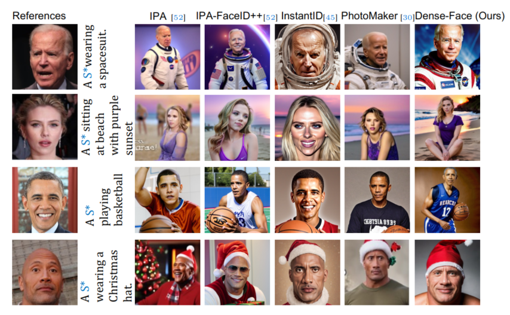

## Dense-face
This repo is the official implementation of "Dense-Face: Personalized Face Generation Model via Dense Annotation Prediction".

**Please do not distribute our source code before the paper decision or we release arXiv.**

**Also, please use the issue section to let us know what issue you have.**



### Quick Start of Source Code
The quick view on the code structure:
```bash
./Dense-Face
    ├── annotation_toolbox
    │      ├── dense_annotation_demo.ipynb (Crop the SD output image and produce the face region mask)
    │      └── ...
    ├── dataset_usage
    │      └── readCelebAFacesDataset.ipynb (Instruction on how to use dataset)
    ├── inference_code
    │      ├── stage_1_text_editing/stage_1_text_editing.ipynb (the Huggingface interface on Text-based Editing mode.)
    │      ├── inference.py (inference code)
    │      ├── inference.sh (inference entrace)
    │      ├── main.py (train code)
    │      ├── main.sh (train entrace)
    │      ├── reference_id (reference image and arcface feature)
    │      ├── ropped_face (base image)
    │      ├── mask (face region mask)
    │      ├── output (output generated samples)
    │      └── ...
    ├── test_samples (we offer 25 test samples)
    └── train_log_webface
           ├── events.out.tfevents.1711259117.cvl10.3064075.0 (tensboard log)
           ├── Train_log_0.png (train log screenshot; time-wise)
           └── Train_log_1.png (train log screenshot; epoch-wise)
```

### Preparation
#### Pre-trained Weights
- Download weights via [link](https://drive.google.com/drive/folders/1b-sNLdfvDkFlm78QnMg2-po-R2G1CNbo), and put them in `inference_code/ckpt`
- These three weights are used for text-edting mode (\*.safetensors), face generation mode (epoch*.ckpt), and training from scratch (\*init.ckpt). 
#### Dataset:
- Download `CASIA_tiny` via [link](https://drive.google.com/drive/folders/1lgjpwneqjhI8ig8cPfUU_zRh9HXPEJ8m?usp=sharing), and put them in `CASIA_tiny`. This is important to run face generation mode.
- If you want to see 5%~10% of the proposed dataset, please go to `CASIA_small`.
- If you want to see the image quality, please go to `CASIA_full` and then check `Image_GFPGAN.tar.gz` or `Image_CodeFromer.tar.gz` for your reference. 
- We offer `dataset_usage/readCelebAFacesDataset.ipynb` for your reference. `readCASIAFacesDataset.ipynb` will be released based upon acceptance.
- T2I-Dense-Face contains face images from CASIA and CelebA, and we will expand it.

#### step 1: Dense-Face's text-editing mode.
- Please refer to `inference_code/stage_1_text_editing/stage_1_text_editing.ipynb`.
- The generated results will be saved in `inference_code/output_stage_1`.
- Do not forget: 
 ```bash
  pip install diffusers
 ```

#### step 2: Crop Face Region via MediaPipe.
- Use MediaPipe to obtain the face region; Pose condition will be solved by inference [code](./inference_code/inference.py#L202).
- Download MediaPipe weights via [link](https://drive.google.com/drive/folders/19kJfLKe3sgw7wn-NiCOObd2vc1cw4w5B?usp=sharing) and put them in `annotation_toolbox`.
- Please refer to `annotation_toolbox/dense_annotation_demo.ipynb` [shortcut](./annotation_toolbox/dense_annotation_demo.ipynb)

#### step 3: Dense-Face's face-generation mode.
- Please run: 
 ```
   cd ../inference_code
   bash inference.sh
 ```
- It uses the reference image arcface feature (`inference_code/reference_id`) to inpaint the face region of `inference_code/ropped_face/`.
- The results are dumped into `inference_code/output`

### WebFace Training.
- To prepare for the rebuttal, we train Dense-Face on the webface in advance. Please refer to the `train_log_webface`
- `Train_log_0.png` and `Train_log_1.png` denote our training timeframe and epoch number. 
- The tensorboard can be seen by `tensorboard --logdir train_log_webface`.
